# Informações do Projeto
`TÍTULO DO PROJETO'
Studify 

`CURSO` 

Ciências da Computação/Turno:manhã 

## Participantes

> - Gabriel Alkmim Barros
> - Gabriel de Cortez Mourão
> - Guilherme Henrique Siqueira de Lana
> - João Gabriel Santos Andrade Almeida
> - Pedro Hosken Fernandes Guimarães
> - Karina Edith Castro Sander Morais

# Estrutura do Documento

- [Informações do Projeto](#informações-do-projeto)
  - [Participantes](#participantes)
- [Estrutura do Documento](#estrutura-do-documento)
- [Introdução](#introdução)
  - [Problema](#problema)
  - [Objetivos](#objetivos)
  - [Justificativa](#justificativa)
  - [Público-Alvo](#público-alvo)
- [Especificações do Projeto](#especificações-do-projeto)
  - [Personas, Empatia e Proposta de Valor](#personas-empatia-e-proposta-de-valor)
  - [Histórias de Usuários](#histórias-de-usuários)
  - [Requisitos](#requisitos)
    - [Requisitos Funcionais](#requisitos-funcionais)
    - [Requisitos não Funcionais](#requisitos-não-funcionais)
  - [Restrições](#restrições)
- [Projeto de Interface](#projeto-de-interface)
  - [User Flow](#user-flow)
  - [Wireframes](#wireframes)
- [Metodologia](#metodologia)
  - [Divisão de Papéis](#divisão-de-papéis)
  - [Ferramentas](#ferramentas)
  - [Controle de Versão](#controle-de-versão)
- [**############## SPRINT 1 ACABA AQUI #############**](#-sprint-1-acaba-aqui-)
- [Projeto da Solução](#projeto-da-solução)
  - [Tecnologias Utilizadas](#tecnologias-utilizadas)
  - [Arquitetura da solução](#arquitetura-da-solução)
- [Avaliação da Aplicação](#avaliação-da-aplicação)
  - [Plano de Testes](#plano-de-testes)
  - [Ferramentas de Testes (Opcional)](#ferramentas-de-testes-opcional)
  - [Registros de Testes](#registros-de-testes)
- [Referências](#referências)

# Introdução

> Com o aumento da disponibilidade de conteúdos on-line, nos dias de hoje
> se torna necessário a validação e o englobamento desses materiais para 
> facilitar e melhorar a experiencia do usuário.
> Nesse sentido, uma área que foi bastante afetada com essa enxurrada de informações e conteúdos
> foi a educação, principalmente as matérias do ensino médio, que possuem bastante oferta e demanda.
> Desse modo, os alunos que estão estudando esse tipo de conteúdo passam por uma experiencia dificultada,
> visto que a internet é um dos principais meios utilizados para estudo, seja relacionado na proucura de exercícios, videoaulas, resumos ou para tirar
> dúvidas, e com esse enormidade de conteúdo disperso e sem validação, eles passam por uma pesquisa prolongada, gastando mais tempo.
> Nesse contexto, torna-se necessário a criação de uma plataforma que auxilie os alunos encontrarem materiais online de qualidade e de forma agrupada, 
> facilitando a sua navegação.
> 
## Problema

> Como dito anteriormente, os conteúdos e materiais se encontram dispersos pela internet e com baixa verificação de qualidade, o que dificulta a pesquisa
> realizada pelos estudantes e interessados. Nosso projeto busca auxiliar esses usuários a encontrarem conteúdos de qualidade e reunidos.

## Objetivos

> O objetivo geral deste trabalho é a criação de uma plataforma que junte e disponibilize, de maneira facilitada e de acesso universal, conteúdos e materiais acerca de
> determinado assunto, que esteja relacionado com matérias do ensino médio, ajudando estudantes e pessoas interessadas sobre o assunto.
> Como objetivos específicos, podemos ressaltar:
  > . Fornecer funcionalidades que ressaltem os melhores conteúdos sobre o assunto
  > . Disponibilizar uma aba com o resumo, vídeos e exercícios sobre o assunto.

## Justificativa

> A internet se tornou essencial para o auxílio de estudantes, tendo seu crescimento com a pandemia e o EAD, obrigando professores e estudantes se conectarem
> por meio da rede. Sob essa lógica, alunos passaram a recorrer cada vez mais plataformas online para retirar dúvidas e aprofundar seu conhecimento, logo nós iremos
> ajudar-los à localizarem de maneira mais fácil e acessível os conteúdos acerca de determinado assunto. Além do mais, falta uma plataforma que reuna de uma forma
> qualificada os materiais, obrigando os usuários a se deslocarem entre páginas. 

## Público-Alvo

> O nosso principal público-alvo são alunos do Ensino médio, os pré-vestibulandos e pessoas interessadas que queiram aprender conteúdos dados nas escolas.
> O nosso público deve ter acesso a internet, mas não necessita ter um conhecimento vasto sobre como navegar, pois nossa plataforma será bastante simples e
> auto-explicativa.

 
# Especificações do Projeto

A seguir estão sendo apresentados as nossas personas, histórias de valor e os requisitos funcionais e não funcionais. Utilizamos para a criação e discussão das personas: 
DOCS(para discussão das suas características e peculiariedades)
LINKS DO RELATÓRIO TÉCNICO E CANVAS(para a criação das personas em geral)
SITES DE PESQUISA(para termos uma base de como seriam nossos requisitos)

## Personas, Empatia e Proposta de Valor

Com base na análise das personas forma identificadas as seguintes histórias de usuários:

 

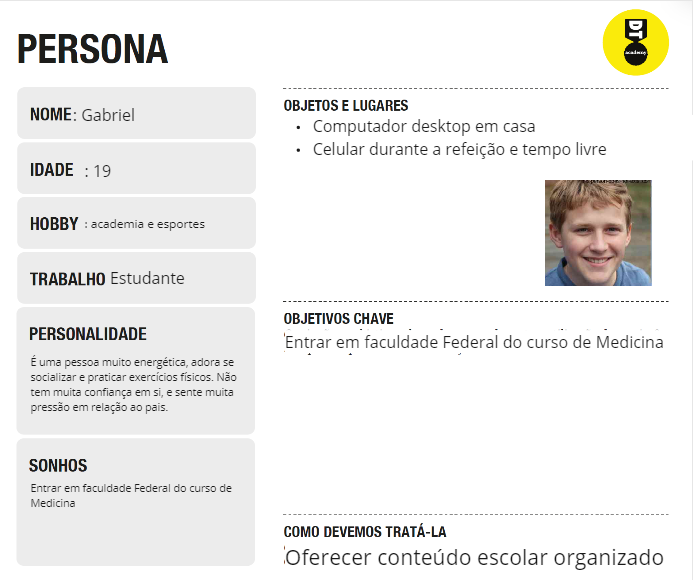
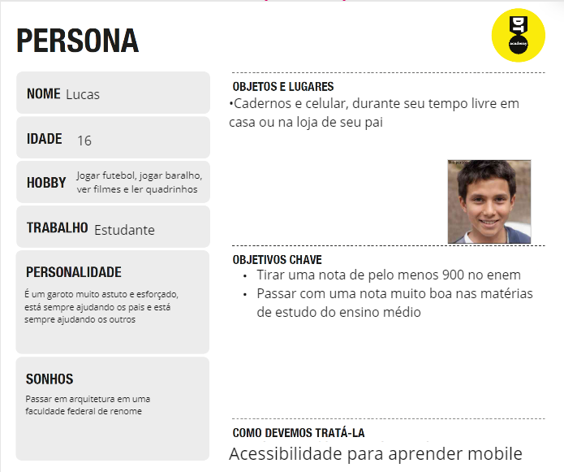
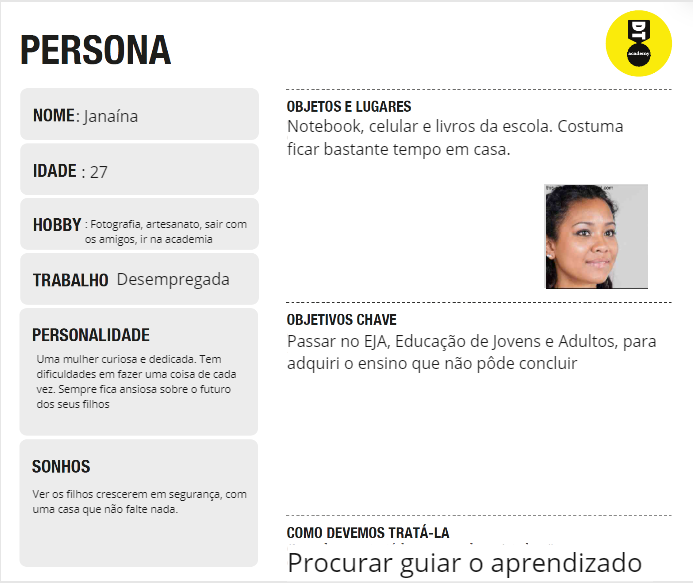

## Histórias de Usuários

|EU COMO... `PERSONA`| QUERO/PRECISO ... `FUNCIONALIDADE` |PARA ... `MOTIVO/VALOR`                 |
|--------------------|------------------------------------|----------------------------------------|
|Janaina | Quer saber quais conteúdos ela precisa mais de estudar          | Organizar o que mais precisa de estudar e a ordem             |
|Janaina | Seleção e filtragem de exercícios de acordo com o que está estudando e já estudou                 | Conseguir fazer exercícios sem ter de se preocupar em selecionar obtê-los |
|Janaina | Fácil acesso para a explicação de um conteúdo sobre o exercício na qual ela errou               | Menos dificuldade e esforço para a revisão |
|Lucas | Menos dificuldade pesquisando algum conteúdo específico que teve dúvida em aula                 | Revisar com maior facilidade apenas a parte que não entendeu |
|Lucas | Aprender tanto no celular quanto no computador                 | Ocupar o tempo livre em casa e na loja estudando |
|Gabriel | Abrir no celular facilmente uma lista exercícios possíveis de fazer mentalmente                | Reforçar o seu aprendizado quando estiver no carro à caminho ou voltando do cursinho e da academia |
|Gabriel | Ver estatística de acertos e tempo de demora para a execução dos exercícios feitos por mês                | Ver seu progresso e como está melhorando em algumas matérias |
 

## Requisitos

As tabelas que se seguem apresentam os requisitos funcionais e não funcionais que detalham o escopo do projeto.

### Requisitos Funcionais

|ID    | Descrição do Requisito  | Prioridade |
|------|-----------------------------------------|----|
|RF-001| Permitir que o usuário pesquise temas específicos diretamente da página principal. | ALTA | 
|RF-002| Permitir que o usuário filtre os exercícios de cada tema por ano, prova e dificuldade.  | MÉDIA |
|RF-003| Recomendar, na aba de cada disciplina, os temas mais pesquisados pelos usuários.| BAIXA | 
|RF-004| Permitir que o usuário acesse alguns vídeos diretamente da página "temas". | MÉDIA |
|RF-005| Permitir que o usuário tenha acesso aos resumo na página de conteúdo. | ALTA |
|RF-006| Permitir que o usuário faça login e tenha sua conta pessoal. | ALTA |
|RF-007| Permitir que o usuário com sua conta pessoal salve conteúdos de interesse. | MÉDIA |
|RF-008| Permitir que o usuário receba notícias da plataforma através do email cadastrado na newsletter. | ALTA |
|RF-009| Permitir que o usuário possa filtrar na aba de videos, da forma desejada . | BAIXA |
|RF-010| Permitir que o usuário acesse as redes sociais do STUDIFY, por meio dos links fixados no rodapé. | ALTA |
|RF-011| O site deve permitir que usuários possam comentar em nos videos e exercicios sobre os temas. | BAIXA |
|RF-010| O site deve se adequar ao formato mobile. | ALTA |

### Requisitos não Funcionais

|ID     | Descrição do Requisito  |Prioridade |
|-------|-------------------------|----|
|RNF-001| Atualizar mensalmente a base de dados dos conteúdos | MÉDIA | 
|RNF-002| Melhorar a interface para aplicativo móvel | ALTA | 
|RNF-003| Processar pedidos de novos conteúdos semanalmente | MÉDIA | 
|RNF-004| Proteger os dados pessoais de cada usuário |  ALTA | 

## Restrições

O projeto está restrito pelos itens apresentados na tabela a seguir.

|ID| Restrição                                             |
|--|-------------------------------------------------------|
|01| A sprint 1 do projeto deverá ser entregue até dia 16/04. |
|02| O projeto, no momento da entrega, deve estar de acordo com os parâmetros instituídos pelos professores.       |

# Projeto de Interface

-TELA PRINCIPAL(menu): Atende os requisitos em relação as compartilhamento de redes socias, recebimento de notícias a partir da inscrição no "Newleetter", segurança e salvamento dos dados de cada usuário.

-TELA "DICIPLINAS": Atende os requisitos em relação a procura de conteúdos mais relevantes e mais vistos

## User Flow

> O diagrama apresentado mostra o fluxo de Interação do usuário pelas telas do sistema. 
> As telas do fluxo do usuário são detalhadas na seção de wireframes que se segue.
> 
> 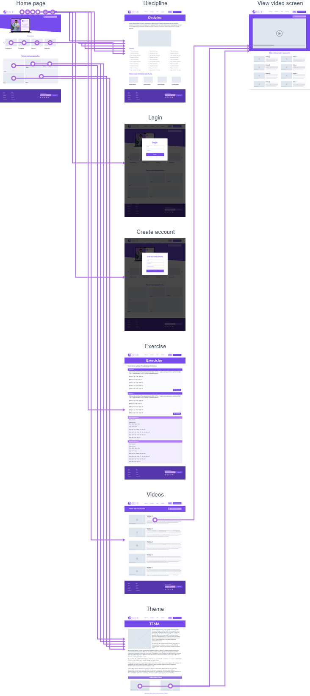

> **Exemplo**:
> 
> 

## Wireframes

Tela - Página Inicial
 A tela da página inicial mostra os conteúdos e disciplinas em destaque na plataforma.
Além disso, por meio do cabeçalho, o usuário tem a possibilidade de criar conta, fazer login na plataforma, acessar a seção de vídeos e a seção de exercícios. A parte de conteúdos traz três opções ao usuário: 
-  Barra de pesquisa utilizada para a busca de temas ou disciplinas especificas
-  Carrossel de disciplinas que leva o usuário a página de cada uma delas
-  Opções dos temas mais pesquisados no site
 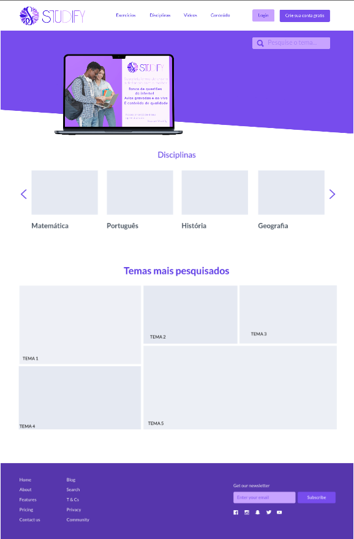
 
 
Tela – Login
 A tela de Login é uma janela modal (surge sobre outras janelas) quando o usuário pressiona o botão “Login” no cabeçalho. Nesta tela, é possível que o usuário acesse sua conta na plataforma. Na sequência, a tela é fechada voltando para o ambiente anterior. 

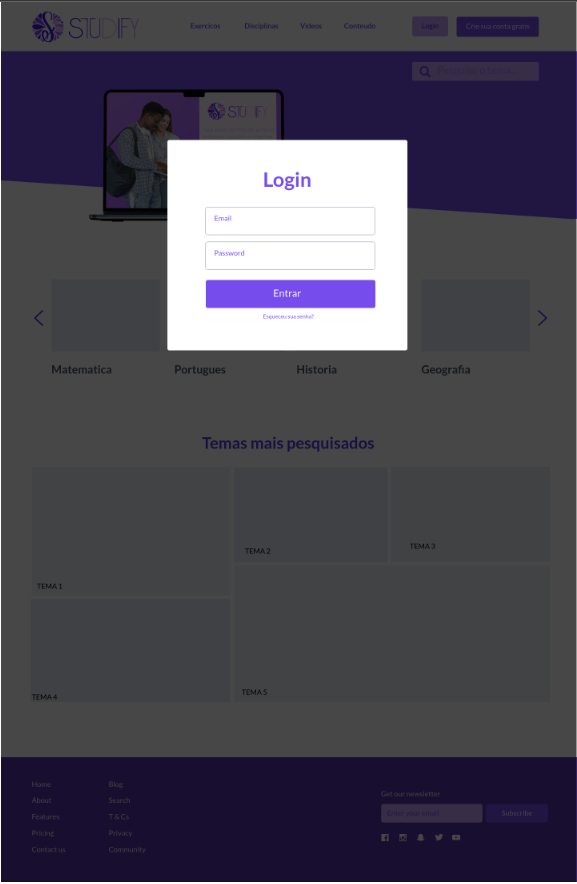

Tela – Criar conta
 A tela de Criação de Conta é uma janela modal (surge sobre outras janelas) quando o usuário pressiona o botão “Crie sua conta grátis” no cabeçalho. Nesta tela, é possível que o usuário crie sua conta na plataforma. Na sequência, a tela é fechada voltando para o ambiente anterior. 
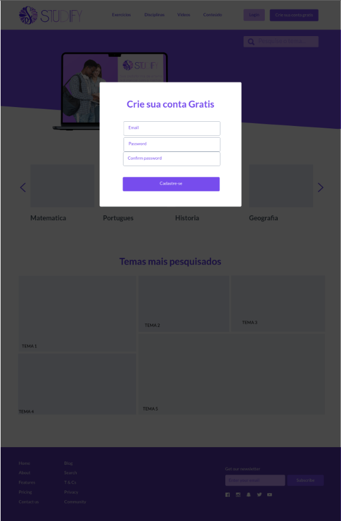

Tela – Disciplinas
 A tela de disciplinas mostra os conteúdos específicos de uma determinada matéria. 
A parte de conteúdo da tela apresenta o nome e uma foto da disciplina em questão, uma lista de temas disponíveis dentro da matéria e uma sessão que apresenta os temas mais vistos. Esta página pode ser acessada por meio da Página principal ou por meio do cabeçalho, a partir de outras telas. 
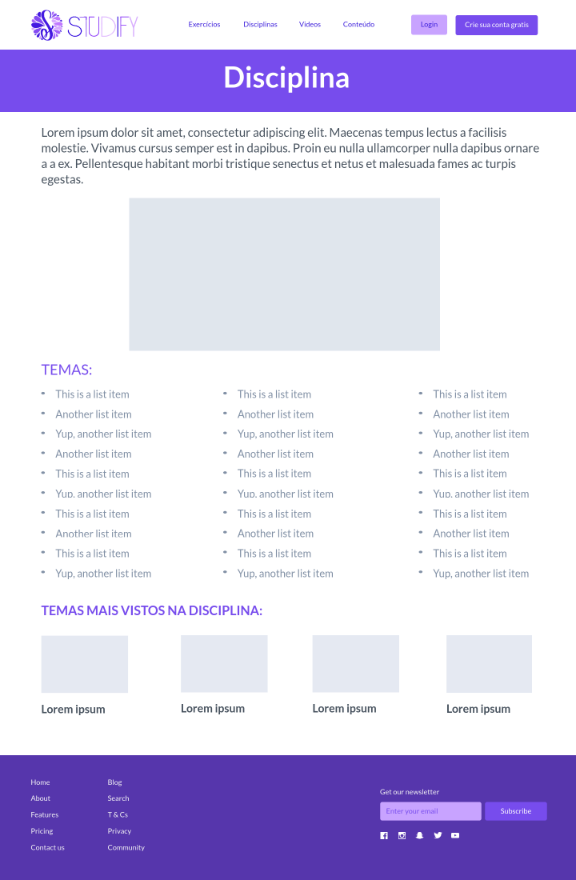  
 
 
Tela – Temas
 A tela de Temas mostra um conteúdo especifico de uma determinada disciplina.
A parte de conteúdo da tela apresenta o nome do tema, uma explicação teórica e algumas opções de vídeos sobre o mesmo. Esta página pode ser acessada por meio da Página de Disciplinas, ou por meio de pesquisas na barra de pesquisa da Página Principal. 
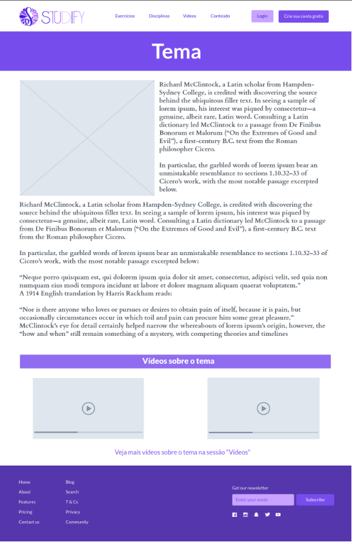  
 
 
Tela – Vídeos
 A tela de Vídeos apresenta vídeos de diversos temas. Os vídeos podem ser filtrados por temas e disciplinas por meio da barra de pesquisa da página.
A parte de conteúdo da tela apresenta uma barra de pesquisa para especificar a busca e opções de vídeos para serem assistidos, possuindo cada um, uma breve descrição do conteúdo a ser exibido. Esta página pode ser acessada por meio da Página Principal, no cabeçalho, e por dentro da Página de Temas. 
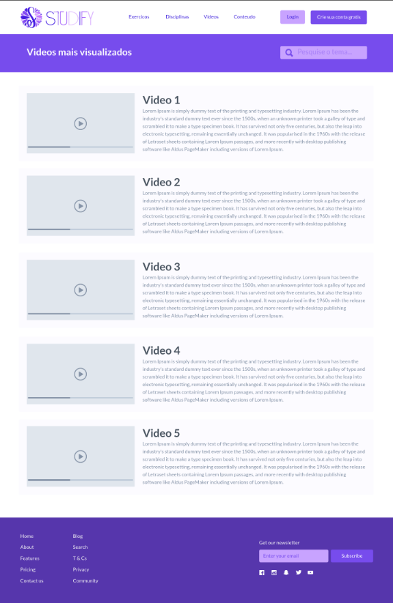  
 
 
Tela – Exibição de Vídeo
 A tela de exibição de vídeos apresenta um vídeo, sua descrição e a opção de mais vídeos sobre o mesmo tema.
A parte de conteúdo da tela apresenta um vídeo, a descrição do mesmo, outras opções de vídeos do mesmo tema ou de temas parecidos e uma barra de pesquisa para a busca de vídeos de outros assuntos. 
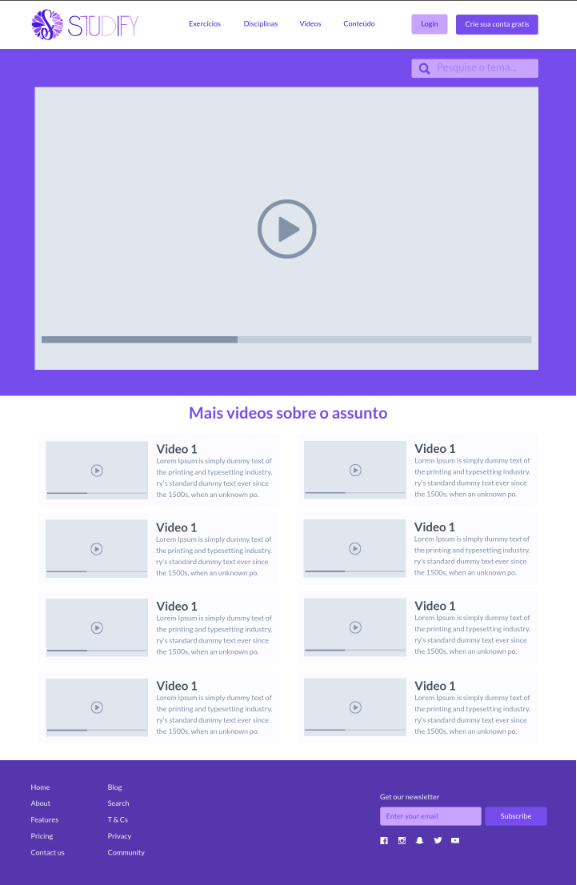  
 
 
Tela – Exercícios
 A tela de Vídeos apresenta alguns exercícios de um determinado tema ou disciplina.
A parte de conteúdo da tela apresenta, além dos exercícios, os gabaritos de cada um, que podem ser acessados ao clicar no botão “ver resposta”. Esta página pode ser acessada pela Página Principal, por meio do cabeçalho. 
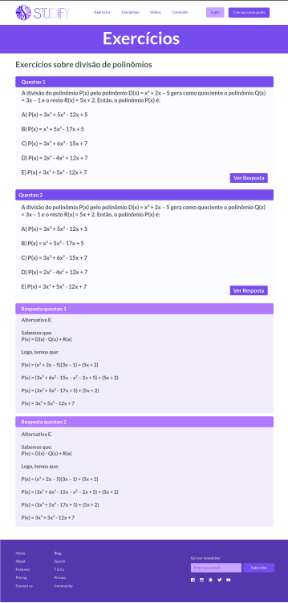  
 
 

# Metodologia

Começamos a contrução do projeto de uma forma mais coletiva, não formamos subgrupos no primeiro momento, mas conseguimos desenvolver muito bem o trabalho  mesmo não sendo da forma mais otimizada. Depois, começamos a dividir as tarefas por escolha dos temas do relatório técnico(Ex: wireframe, personas, apresentação, etc), assim o projeto foi se aperfeiçoando. 
Durante todo o progresso tentamos sempre colocar como referência a pesquisa que fizemos pelo forms, que apresentava a opinião real de pessoas que sofrem com a problemática. Dessa forma, nós conseguimos adaptar nossa ideia para a solução de maneira menos desconexa com a realidade.

## Divisão de Papéis

Gabriel Alkmim Barros: Projeto de Interface e Especificações do projeto.
Gabriel de Cortez Mourão: Design Thinking e Especificações do projeto.
Guilherme Henrique Siqueira de Lana: Projeto de Interface.
João Gabriel Santos Andrade Almeida: Especificações do projeto e Metodologia.
Pedro Hosken Fernandes Guimarães: Apresentação, Aba de concepção e contexto do projeto.
Karina Edith Castro Sander Morais: Design Thinking.

## Ferramentas

| Ambiente  | Plataforma              |Link de Acesso |
|-----------|-------------------------|---------------|
|Processo de Design Thinking  | Miro/Google Docs |  https://miro.com/app/board/uXjVMU6iLHA=/  --/--  https://docs.google.com/document/d/1ZU70-QrEEN2EgrgSHwWD-5lSUGG2r8eTpkAz8TjTwDQ/edit?usp=sharing | 
|Repositório de código | GitHub |  https://github.com/ICEI-PUC-Minas-PMGCC-TI/ti-1-pmg-cc-m-20231-tiaw-questoes-sobre-educacao-1/edit/master/docs/relatorio/Relatorio%20Tecnico%20-%20TEMPLATE.md  | 
|Listagem de tarefas | Trello |  https://trello.com/invite/b/FdkY24Xh/ATTI4fda10ebf9968bd628a0bb8329754679A355C309/sprint-i | 
| Construção do Wireframe | Marvel App | https://marvelapp.com/prototype/881c0cj |

As ferramentas empregadas no projeto são:

> - Editor de código
> - Ferramentas de comunicação
> - Ferramentas de organização
> - Ferramentas de pesquisa 

Usamos o editor de códigos para criar nossas estruturas de wireframe. Utilizamos as ferramentas de comunicação para interagimos uns com os outros em tempo real para a realização sincronizada das tarefas, além de disseminar as nossas perguntas qualitativas para várias pessoas. As ferramentas de organização foram usadas para ajudar o grupo na divisão das tarefas e na dinamização do trabalho. E por fim, utilizamos as ferramentas de pesquisa para aprofundarmos nos dados que precisamos e para nos dar um suporte para contruírmos uma solução coerente.

| Ambiente  | Plataforma              |Link de Acesso |
|-----------|-------------------------|---------------|
|Processo de Design Thinkgin  | Miro |  https://miro.com/XXXXXXX | 
|Repositório de código | GitHub | https://github.com/XXXXXXX | 
|Hospedagem do site | Heroku |  https://XXXXXXX.herokuapp.com | 
|Protótipo Interativo | MavelApp ou Figma | https://figma.com/XXXXXXX | 

## Controle de Versão

O projeto será feito na ferramenta de gerenciamento de projetos chamada github, e para evitar códigos conflitantes mesmo com diversas features sendo adicionadas ao mesmo tempo, o projeto seguirá um workflow de "Develop Branch", conforme a imagem:

O projeto adota a seguinte convenção para branches:
A branch principal, a *master* conterá o conteúdo de entrega preparada. Quando o time fizer uma nova entrega para ser testada pelo product owner e o cliente, ela será feita la 
A branch *develop* terá a versão com as features mais recentemente adicionadas, e será onde branches de *features*, onde os integrantes irão programar separadamente adições distintas no código, serão mescladas. 
A branch *develop* entrará em um processo de revisão depois da adição das features desejadas para a nova versão, e caso ela seja estável, será mesclada com a branch *master*. Caso ela não seja, ela mesclara com a *master* e seguirá como um branch *develop* até que os problemas de instabilidade sejam resolvidos. 

O projeto adota a seguinte convenção para a nomenclatura das versões:
- A primeira versão de uma branch nova será 1.0.0
- Mudanças muito pequenas como a correção ortográfica do código incrementam o último decimal (x. x. x+1)
- Mudanças mais significativas como bugfixes e novas feature incrementam a versão no decimal do meio (x. x+1. x)
- Mudanças muito significativas como o lançamento de uma novo produto teste para o cliente incrementam o primeiro decimal (x+1. x. x)

# **############## SPRINT 1 ACABA AQUI #############**

# Projeto da Solução

Nosso projeto se baseia na problemática da falta de confiabilidade e organização de informações educacionais na internet. Visando isso, buscamos agrupar por meio de resumos, vídeos, exercícios,  uma grande parte de conteúdos para a otimização dessa busca cansativa. Assim, nosso site serve como uma grande central de informações, podendo ser de matérias tanto do Ensino Médio, quanto da própria faculdade.

## Tecnologias Utilizadas

Nosso grupo fez uso de algumas tecnologias que eram fundamentais para a criação do trabalho. Entre elas estão o git, na qual usamos para integrar todas as partes do nosso trabalho, nos ajudou a organizar todo nosso sistema para uma eficácia maior na hora de trabalharmos. Usamos o Vs Code, que foi o principal método de progamação do grupo, foi utilizado com a participação do git para fazer todas as mudanças feitas. E por fim, usamos dentro das funcionalidades do nosso site, o YouTube, que é de suma importância para a apresentação das informações que nosso site busca agrupar, ele é uma grande ferramenta que faz nosso site ter um diferencial em quesitos de agrupamento de soluções nos estudos.

 
 
 Se você se sentiu familiziarizado com este userflow, é por que este foi o mesmo que apresentamos previamente neste documento. Ele mostra a simples interconexão entre as diversas opção de navegação da página principal com as outras página auxiliares, o que simplifica muito ter uma visão geral do fluxo
 

Este novo userflow por vez mostra a interconexão de forma mais detalhada do protótipo mais recente, mostrando o possíveis usos passo a passo do site

## Arquitetura da solução

......  COLOQUE AQUI O SEU TEXTO E O DIAGRAMA DE ARQUITETURA .......

Por se um trabalho mais focado no front-end, não temos muita base em comunicar com servidores externos. Como podemos ver pelo fluxo, a maioria dos dados são pegos pelo protótipo atual usando o local storage, e a unica comunicação que temos fora do servidor hospedeiro com a máquina seria com os iframes de vídeos do youtube

# Avaliação da Aplicação

Ambiente mobile(responsividade).
Teste geral do site(integração e funcionalidades).
Teste de outras pessoas de fora(opinião sobre futuras atualizações e features).

## Plano de Testes

Primeiro fomos para o âmbito móvel, testamos todas nossas páginas para ver se eram adaptáveis á esse ambiente, mudamos alguns detalhes para ficar mais fácil a interação.
Testamos também algumas funcionalidades extras não escritas nos nossos requisitos, como a mudança na home dependendo da sua indentidade como administrador ou como usuário.
No fim, conferimos se todas as partes realizadas individualmente foram bem integradas para a entrega do projeto final.
Depois disso, mandamos nosso site pronto para amigos e conhecidos a fim de testar se suas funcionalidades estavam todas em ordem e se o próprio conteúdo era satisfatório.

## Ferramentas de Testes (Opcional)

-----------------------------------

## Registros de Testes

1- Sucesso, conseguimos resolver o problema da responsividade.
2- Sucesso, tudo foi integrado e não houve complicações.
3- A maioria das opiniões vindas de fora eram de desconhecidos, para uma avaliação mais real sobre problemas e mudanças que deveriam ser implementadas.

Suma: nosso site ainda é apenas um começo, precisa de várias melhorias para ser um site utilizável futuramente com um pensamento de marketing, mas atualmente com as capacidades que temos, foi um completo e maravilhoso projeto.

# Referências

Sites educacionais (ex: BrasilEscola, Estudo.com, etc).
